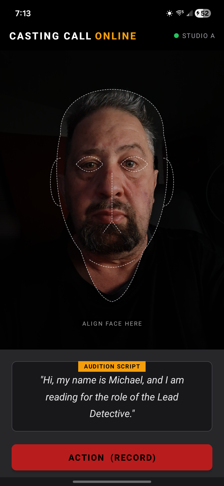
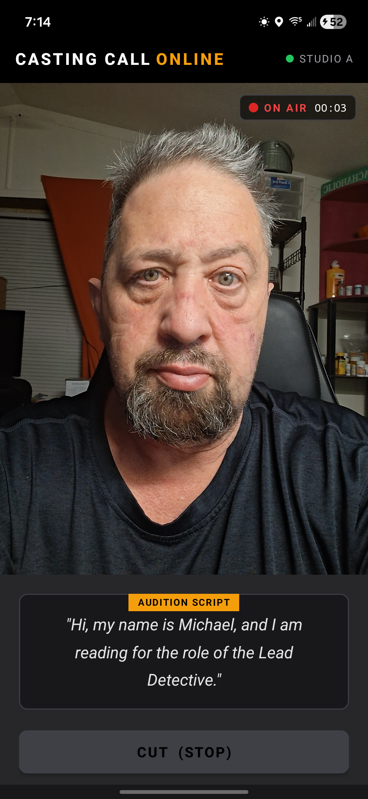
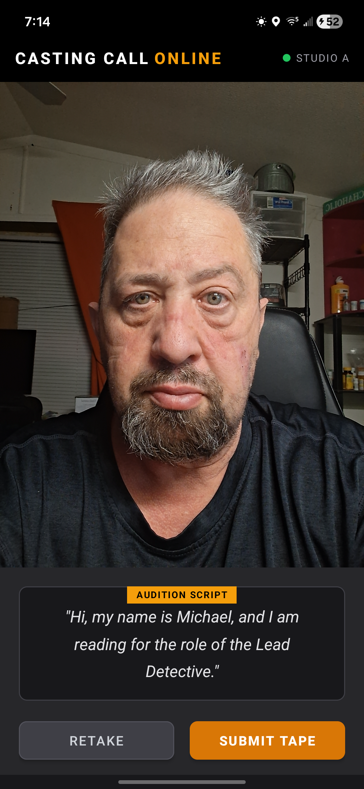
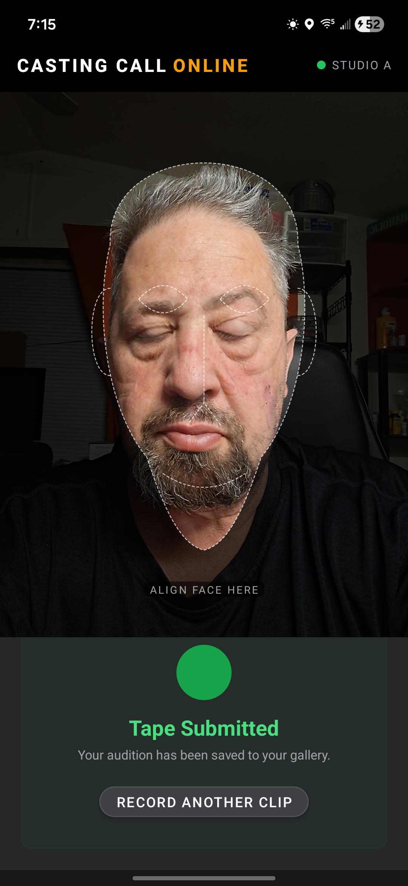

# Sizzlr

An Android audition recorder for actors. Record HD video clips on your phone and submit them directly to casting directors — no email, no cloud links, no friction.

**Live preview:** http://tek.chaosnet.org/sizzle/

---

## Features

- **Face-alignment guide** — dotted face schematic overlay so you nail the headshot/medium-shot framing every take
- **Front camera recording** — HD video with audio, mirrored preview so it feels natural
- **ON AIR indicator** — pulsing red dot and live timer while recording
- **On-device save** — clips saved automatically to `Movies/Sizzlr/` in your gallery
- **Retake flow** — record as many takes as you want, keep the best one
- **Dark cinema theme** — matches the Casting Call Online aesthetic

## Screens

| Idle | Recording | Review | Submitted |
|------|-----------|--------|-----------|
|  |  |  |  |

## Requirements

- Android 8.0+ (API 26)
- Camera + microphone permissions (prompted on first launch)

## Build

```bash
export ANDROID_HOME=/path/to/Android/sdk
./gradlew assembleDebug
# APK → app/build/outputs/apk/debug/app-debug.apk
```

Install to a connected device:

```bash
./gradlew installDebug
```

## Tech Stack

- **Kotlin** / Android SDK 34
- **CameraX 1.3.1** — `VideoCapture<Recorder>` + `MediaStoreOutputOptions`
- **Material Components** + ViewBinding
- **Gradle 8.4** / AGP 8.2.2

## Project Structure

```
app/src/main/
├── java/org/chaosnet/sizzlr/
│   ├── MainActivity.kt      # Camera setup, recording state machine
│   └── FaceGuideView.kt     # Custom Canvas overlay (face alignment guide)
└── res/
    ├── layout/activity_main.xml
    └── values/colors.xml    # Zinc/amber design tokens
```
